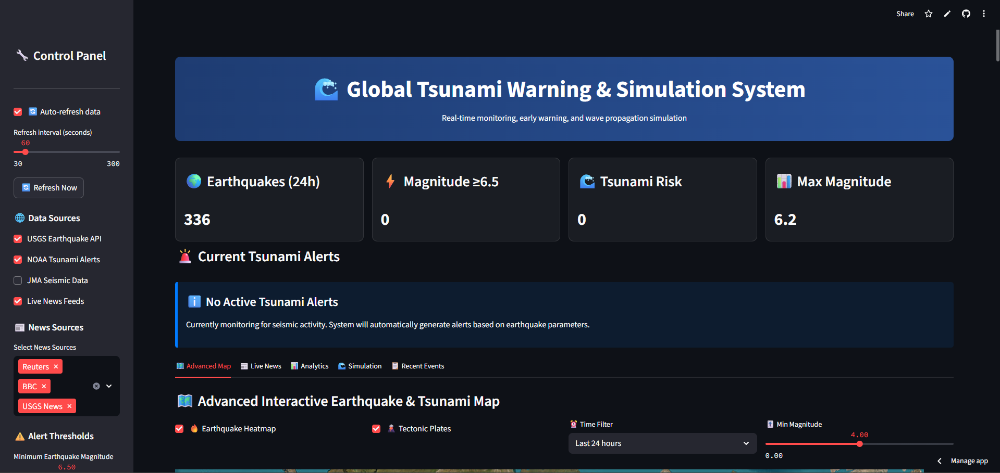

# 🌊 Global Tsunami Warning & Simulation System



## Overview
The **Global Tsunami Warning & Simulation System** is a real-time monitoring and simulation dashboard designed to provide critical information about earthquakes and potential tsunami threats. This application leverages data from multiple sources, including USGS, NOAA, and live news feeds, to deliver timely updates and visualizations for seismic activity and tsunami risks.

## Features

### 🌍 Real-Time Earthquake Monitoring
- Fetches earthquake data from the USGS Earthquake API.
- Displays key metrics such as the number of earthquakes, maximum magnitude, and tsunami risks.
- Provides detailed information about each earthquake, including location, magnitude, depth, and time.

### 🌊 Tsunami Alert System
- Processes tsunami alerts based on earthquake parameters (magnitude, depth, etc.).
- Categorizes alerts into threat levels: **EXTREME**, **HIGH**, **MEDIUM**, **LOW**, and **MINIMAL**.
- Displays estimated tsunami arrival times for major coastal cities.

### 🗺️ Advanced Interactive Map
- Visualizes earthquake and tsunami data on an interactive map using Folium.
- Includes multiple layers such as:
  - Earthquake markers with dynamic styling based on magnitude and age.
  - Tsunami alert zones with expanding circles for different threat levels.
  - Tectonic plate boundaries.
  - Heatmap for earthquake density.
- Allows users to click on map markers to view detailed information about specific earthquakes.

### 📊 Seismic Activity Analytics
- Provides visualizations for:
  - Magnitude distribution.
  - Depth vs. magnitude scatter plots.
  - Daily earthquake counts.
  - Tsunami threat level distribution.

### 🌊 Tsunami Wave Propagation Simulation
- Simulates tsunami wave propagation based on earthquake parameters (latitude, longitude, magnitude).
- Displays wave height and affected areas over time.
- Provides a summary of the simulation, including maximum wave height and affected grid points.

### 📰 Live News Feeds
- Fetches and displays earthquake and tsunami-related news from multiple sources (e.g., Reuters, BBC, CNN, USGS News).
- Filters news by source and relevance.
- Displays news articles in a card-based layout with links to full articles.

### 🔧 Customizable Settings
- Allows users to configure:
  - Data sources (USGS, NOAA, JMA, live news feeds).
  - Alert thresholds (minimum magnitude, maximum depth, tsunami warning magnitude).
  - Auto-refresh interval (30 to 300 seconds).

## Installation

### Prerequisites
- Python 3.8 or higher
- pip (Python package manager)

### Steps
1. Clone the repository:
   ```bash
   git clone https://github.com/TheODDYSEY/Earthquake-Tsunami-Website.git
   cd Earthquake-Tsunami-Website
   ```
2. Install the required dependencies:
   ```bash
   pip install -r requirements.txt
   ```
3. Run the Streamlit app:
   ```bash
   streamlit run streamlit_app.py
   ```

## Usage
1. Open the app in your browser (Streamlit will provide a local URL).
2. Use the sidebar to configure settings such as data sources, alert thresholds, and auto-refresh intervals.
3. Explore the tabs for different functionalities:
   - **Advanced Map**: View earthquake and tsunami data on an interactive map.
   - **Live News**: Stay updated with the latest news.
   - **Analytics**: Analyze seismic activity trends.
   - **Simulation**: Run tsunami wave propagation simulations.
   - **Recent Events**: View a table of recent earthquake events.

## Technologies Used
- **Frontend**: Streamlit for interactive UI.
- **Backend**: Python for data processing and API integration.
- **Data Visualization**: Plotly, Folium, and Streamlit widgets.
- **APIs**:
  - USGS Earthquake API
  - NOAA Tsunami Alerts (simulated)
  - Live news feeds (RSS/Atom)

## File Structure
```
Earthquake-Tsunami-Website/
├── streamlit_app.py          # Main Streamlit app file
├── tsunami_app.py            # Additional app logic and components
├── requirements.txt          # Python dependencies
└── README.md                 # Project documentation
```

## Contributing
Contributions are welcome! If you have suggestions for new features or improvements, feel free to open an issue or submit a pull request.

## License
This project is licensed under the MIT License. See the [LICENSE](LICENSE) file for details.

## Acknowledgments
- USGS for providing earthquake data.
- NOAA for tsunami alert guidelines.
- Streamlit for making data visualization and app development easy.

---

Feel free to reach out if you have any questions or feedback!
